# 🏗️ AstraSecure System Architecture

## 🎯 High-Level Architecture Overview

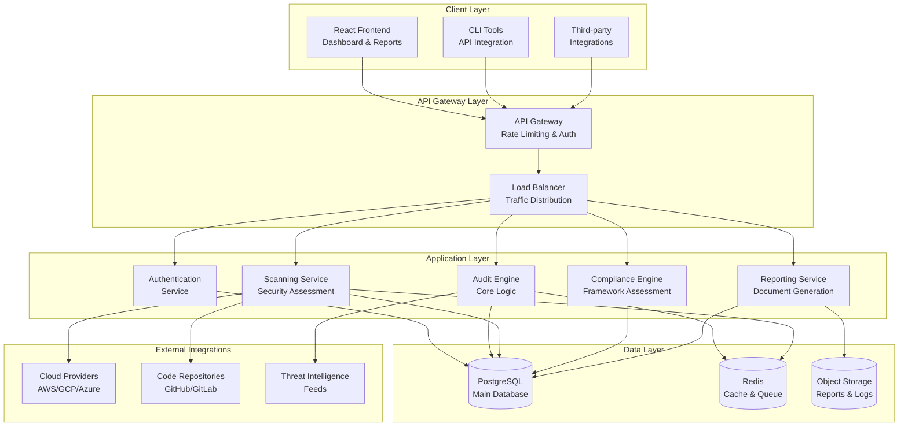

## 🔧 Component Architecture Details

### Frontend Architecture
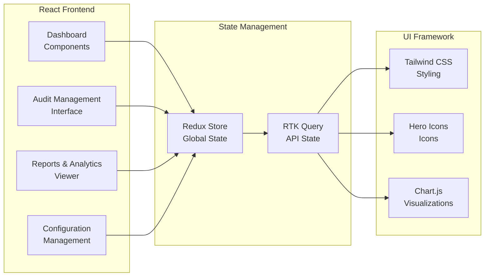

### Backend Service Architecture
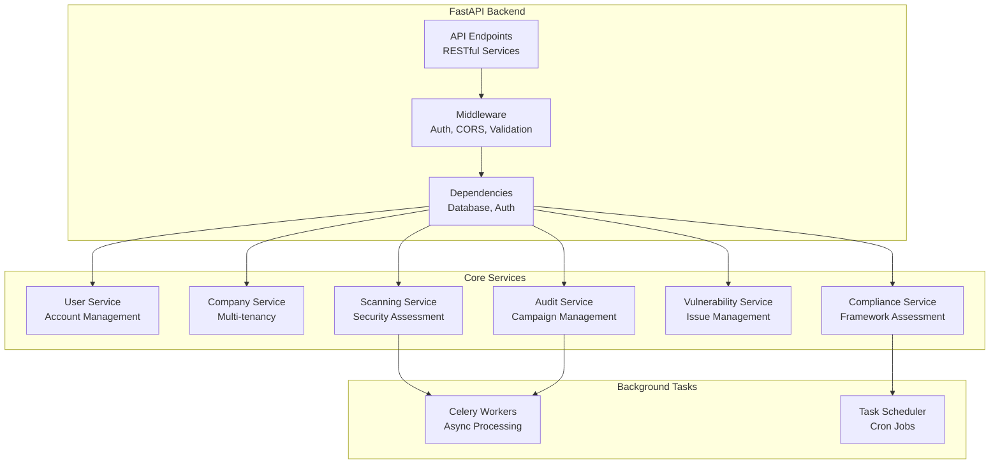

## 🗄️ Database Schema Architecture

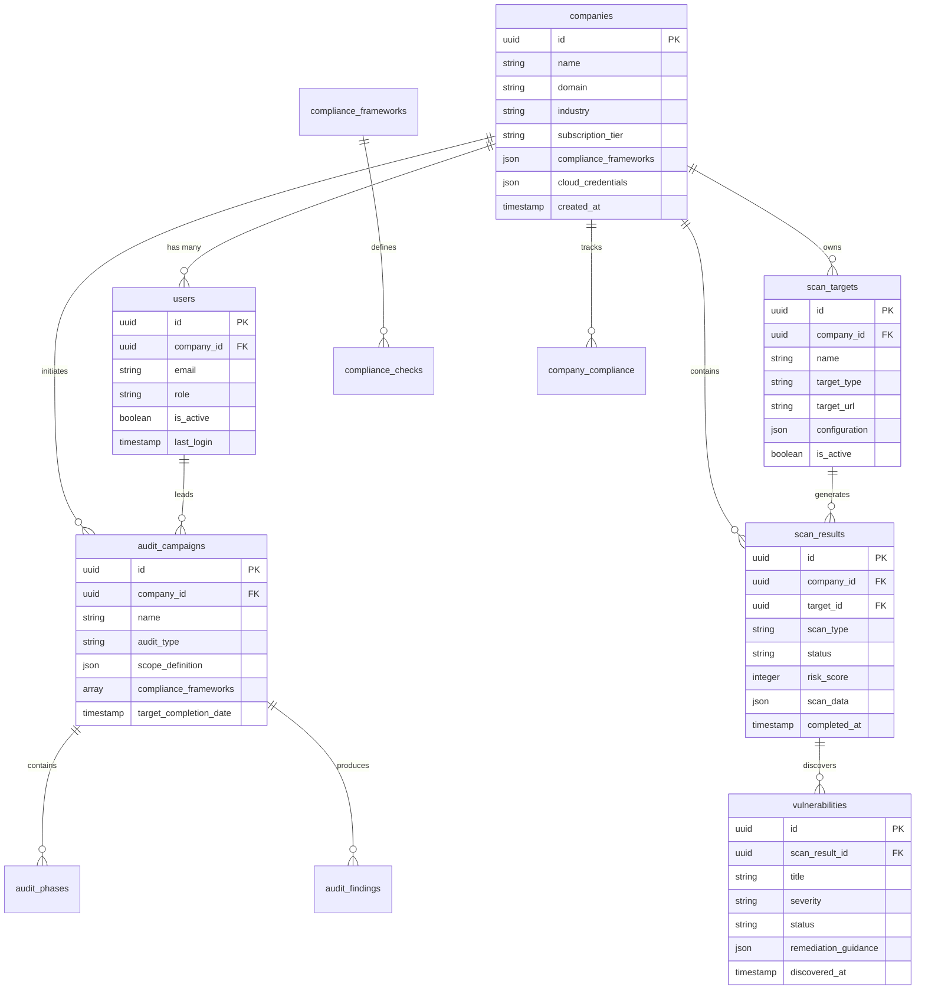

## 🔄 Audit Workflow Architecture

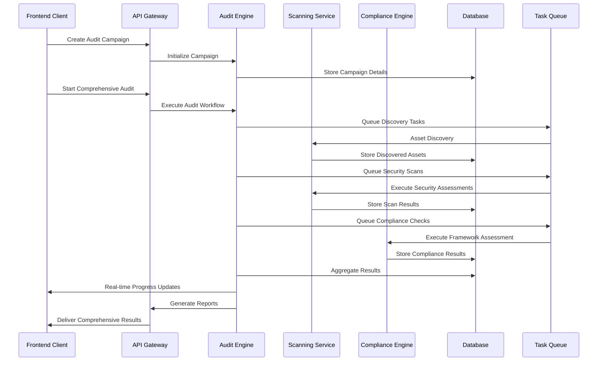

## 🛡️ Security Architecture

### Multi-Tenant Data Isolation
```mermaid
graph TB
    subgraph "Application Security"
        JWT[JWT Authentication<br/>Token-based Auth]
        RBAC[Role-Based Access<br/>Control]
        API_KEYS[API Key<br/>Management]
    end
    
    subgraph "Data Security"
        ENCRYPTION[Data Encryption<br/>At Rest & Transit]
        ISOLATION[Tenant Isolation<br/>Row-Level Security]
        AUDIT_LOG[Audit Logging<br/>All Actions Tracked]
    end
    
    subgraph "Network Security"
        TLS[TLS 1.3<br/>Encryption]
        FIREWALL[Web Application<br/>Firewall]
        RATE_LIMIT[Rate Limiting<br/>DDoS Protection]
    end
    
    JWT --> RBAC
    RBAC --> API_KEYS
    
    ENCRYPTION --> ISOLATION
    ISOLATION --> AUDIT_LOG
    
    TLS --> FIREWALL
    FIREWALL --> RATE_LIMIT
```

### Scanning Security Model
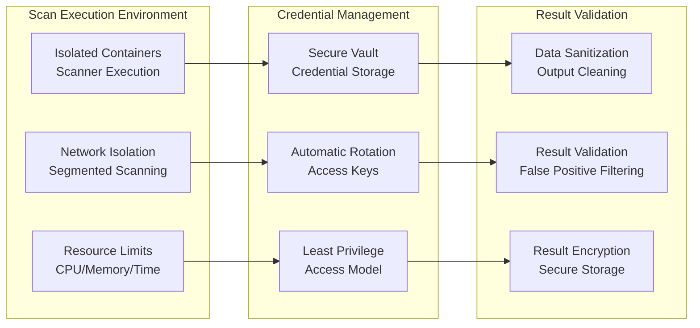

## 🚀 Deployment Architecture

### Production Environment
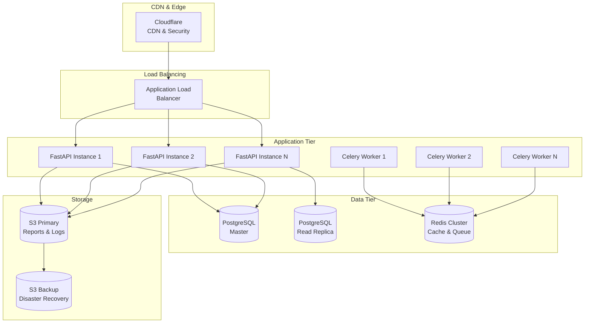

### Container Architecture
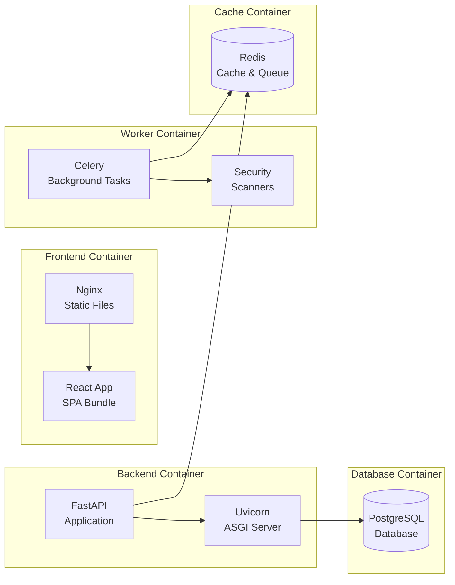

## 📊 Monitoring & Observability Architecture

```mermaid
graph TB
    subgraph "Application Monitoring"
        METRICS[Prometheus<br/>Metrics Collection]
        ALERTS[AlertManager<br/>Alert Routing]
        DASHBOARD[Grafana<br/>Visualization]
    end
    
    subgraph "Logging"
        LOG_COLLECT[Fluentd<br/>Log Collection]
        LOG_STORE[ElasticSearch<br/>Log Storage]
        LOG_VIZ[Kibana<br/>Log Analysis]
    end
    
    subgraph "APM"
        TRACE[Jaeger<br/>Distributed Tracing]
        PERFORMANCE[New Relic<br/>Performance Monitoring]
    end
    
    subgraph "Health Checks"
        HEALTH[Health Endpoints<br/>/health, /metrics]
        UPTIME[Uptime Monitoring<br/>External Checks]
    end
    
    METRICS --> ALERTS
    ALERTS --> DASHBOARD
    
    LOG_COLLECT --> LOG_STORE
    LOG_STORE --> LOG_VIZ
    
    TRACE --> PERFORMANCE
    
    HEALTH --> UPTIME
```

## 🔗 Integration Architecture

### External Service Integrations
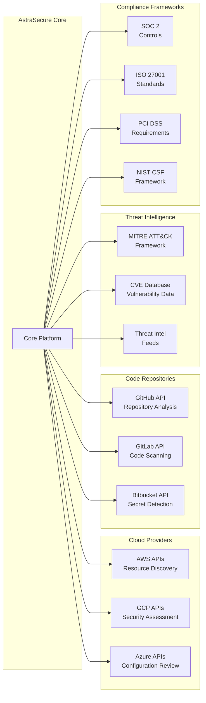

This architecture provides a comprehensive view of how AstraSecure is designed to handle enterprise-scale security auditing with high availability, security, and scalability.