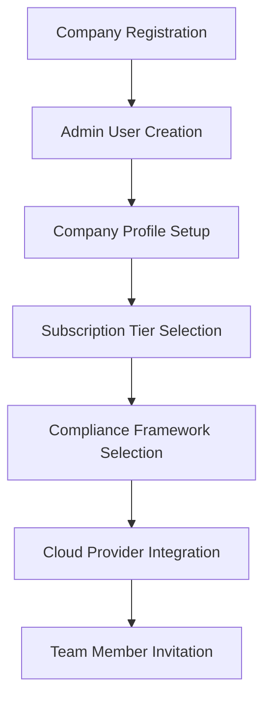
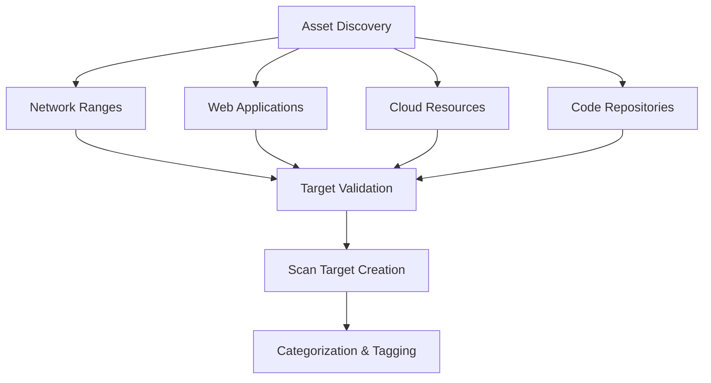
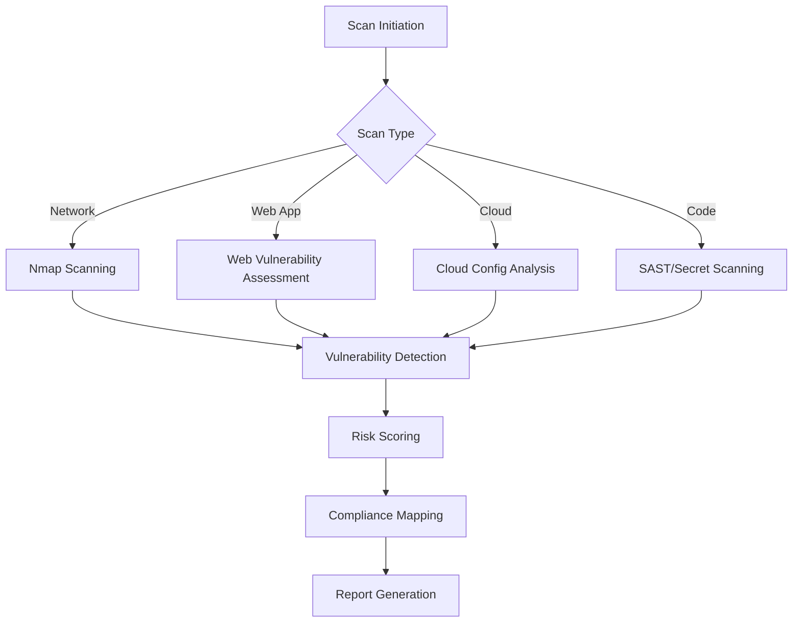
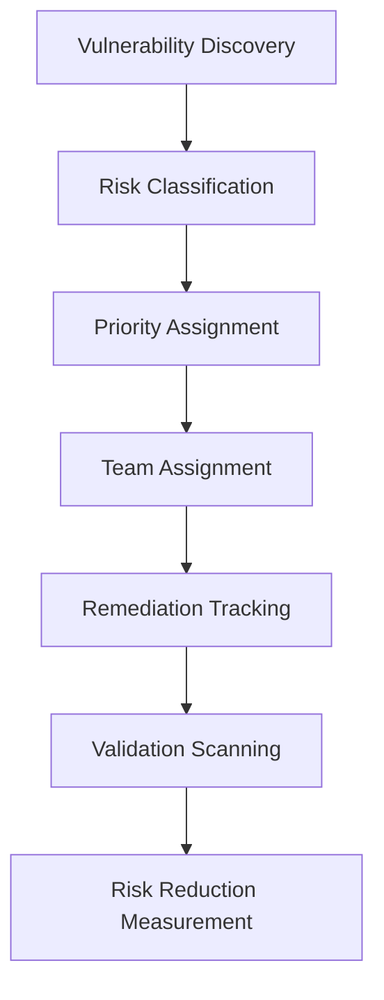

# 🔍 AstraSecure: Complete Project Flow & Company Audit Process

## 📋 Table of Contents
- [Project Overview](#project-overview)
- [System Architecture](#system-architecture)
- [Complete Project Flow](#complete-project-flow)
- [Production Company Audit Process](#production-company-audit-process)
- [Technical Implementation](#technical-implementation)
- [Compliance Frameworks](#compliance-frameworks)
- [Audit Methodology](#audit-methodology)

---

## 🎯 Project Overview

**AstraSecure** is a comprehensive, multi-tenant SaaS cybersecurity auditing platform that provides automated AI-driven security assessments of IT infrastructure. It's designed to help companies achieve and maintain compliance with various security frameworks while continuously monitoring their security posture.

### Key Capabilities:
- **Multi-tenant Architecture**: Secure isolation between companies
- **Automated Security Scanning**: Network, web, cloud, and code security assessments
- **Compliance Management**: SOC2, PCI-DSS, ISO27001, HIPAA, GDPR, NIST CSF
- **AI-Driven Risk Assessment**: Intelligent vulnerability prioritization
- **Real-time Monitoring**: Continuous security posture assessment
- **Comprehensive Reporting**: Executive and technical reports with remediation guidance

---

## 🏗️ System Architecture

### Technology Stack
```
Frontend (React 18 + Tailwind CSS)
    ↕️ REST API + WebSocket
Backend (FastAPI + Python 3.12)
    ↕️ SQLAlchemy ORM
Database (PostgreSQL)
    ↕️ Background Tasks
Task Queue (Celery + Redis)
    ↕️ Security Scanners
Scanning Services (Nmap, Nikto, Custom)
```

### Core Components

#### 1. **Multi-Tenant Data Model**
```
Companies (Tenants)
├── Users (Role-based access)
├── Scan Targets (Assets to audit)
├── Scan Results (Audit findings)
├── Vulnerabilities (Security issues)
├── Compliance Checks (Framework requirements)
└── Audit Logs (Full traceability)
```

#### 2. **Authentication & Authorization**
- JWT-based authentication with configurable expiry
- Role-based access control:
  - **Super Admin**: Platform-wide access
  - **Company Admin**: Full company access
  - **Security Analyst**: Read/write security data
  - **Viewer**: Read-only access
- API key support for programmatic access

#### 3. **Security Scanning Engine**
- **Network Scanning**: Nmap-based port scanning and service detection
- **Web Application Security**: Nikto and custom vulnerability checks
- **Cloud Configuration**: AWS, GCP, Azure security assessments
- **Code Security**: Repository scanning for secrets and misconfigurations
- **Compliance Auditing**: Automated compliance check execution

---

## 🔄 Complete Project Flow

### Phase 1: Company Onboarding


**Process Details:**
1. **Registration**: Company registers with business details
2. **Profile Setup**: Industry, size, compliance requirements
3. **Integrations**: AWS/GCP/Azure credentials configuration
4. **Team Setup**: Invite users with appropriate roles
5. **Initial Configuration**: Scan schedules, notification preferences

### Phase 2: Asset Discovery & Target Configuration


**Asset Types:**
- **Network Targets**: IP addresses, CIDR ranges, hostnames
- **Web Applications**: Domain names, URLs, web services
- **Cloud Resources**: Auto-discovered via cloud APIs
- **Code Repositories**: GitHub/GitLab repository URLs

### Phase 3: Comprehensive Security Scanning


**Scanning Capabilities:**
- **Network Scanning**: Port discovery, service enumeration, OS fingerprinting
- **Web Security**: SQL injection, XSS, CSRF, security headers
- **Cloud Security**: IAM misconfigurations, storage permissions, network security
- **Code Security**: Hardcoded secrets, insecure dependencies, OWASP Top 10

### Phase 4: Vulnerability Management & Remediation


---

## 🏢 Production Company Audit Process

### Complete Audit Workflow

#### 1. **Pre-Audit Phase** (Days 1-3)
```
📋 Audit Planning
├── Scope Definition
├── Asset Inventory
├── Compliance Requirements Analysis
├── Risk Assessment Framework Setup
└── Stakeholder Communication Plan
```

**Activities:**
- **Scope Definition**: Define audit boundaries, systems, and applications
- **Asset Discovery**: Comprehensive inventory of all IT assets
- **Compliance Framework Selection**: Choose applicable standards (SOC2, ISO27001, etc.)
- **Risk Appetite Configuration**: Set company-specific risk thresholds
- **Communication Plan**: Notify stakeholders of audit timeline

#### 2. **Automated Discovery Phase** (Days 4-7)
```
🔍 Comprehensive Asset Discovery
├── Network Infrastructure Mapping
├── Web Application Cataloging
├── Cloud Resource Enumeration
├── Code Repository Analysis
└── Third-party Service Integration Assessment
```

**Technical Process:**
```python
# Automated Discovery Workflow
class CompanyAuditEngine:
    def execute_full_discovery(self, company_id):
        # Network discovery
        network_assets = self.discover_network_infrastructure()
        
        # Cloud resource discovery
        cloud_assets = self.discover_cloud_resources()
        
        # Web application discovery
        web_assets = self.discover_web_applications()
        
        # Code repository analysis
        code_assets = self.analyze_code_repositories()
        
        # Create scan targets
        self.create_scan_targets(company_id, all_assets)
```

#### 3. **Multi-Vector Security Assessment** (Days 8-14)
```
🛡️ Comprehensive Security Scanning
├── Network Vulnerability Assessment
│   ├── Port Scanning (TCP/UDP)
│   ├── Service Enumeration
│   ├── Operating System Detection
│   └── Network Device Analysis
├── Web Application Security Testing
│   ├── OWASP Top 10 Assessment
│   ├── Authentication/Authorization Testing
│   ├── Input Validation Analysis
│   └── Session Management Review
├── Cloud Security Configuration Review
│   ├── IAM Policy Analysis
│   ├── Storage Bucket Security
│   ├── Network Security Groups
│   └── Encryption Configuration
└── Code Security Analysis
    ├── Static Application Security Testing (SAST)
    ├── Dependency Vulnerability Scanning
    ├── Secret Detection
    └── Infrastructure as Code Review
```

**Scan Execution Process:**
```python
class ProductionAuditScanner:
    def execute_comprehensive_audit(self, company_id):
        scan_results = []
        
        # 1. Network Infrastructure Scan
        for target in self.get_network_targets(company_id):
            result = self.network_scanner.comprehensive_scan(target)
            scan_results.append(result)
        
        # 2. Web Application Assessment  
        for webapp in self.get_web_applications(company_id):
            result = self.web_scanner.security_assessment(webapp)
            scan_results.append(result)
        
        # 3. Cloud Configuration Review
        for cloud_env in self.get_cloud_environments(company_id):
            result = self.cloud_scanner.configuration_audit(cloud_env)
            scan_results.append(result)
        
        # 4. Code Repository Analysis
        for repo in self.get_repositories(company_id):
            result = self.code_scanner.security_analysis(repo)
            scan_results.append(result)
        
        return self.aggregate_results(scan_results)
```

#### 4. **Compliance Assessment** (Days 15-18)
```
📊 Compliance Framework Analysis
├── Control Mapping
│   ├── SOC 2 Type II Controls
│   ├── ISO 27001 Controls
│   ├── PCI-DSS Requirements
│   ├── NIST Cybersecurity Framework
│   └── Industry-Specific Standards
├── Evidence Collection
├── Gap Analysis
└── Compliance Scoring
```

**Compliance Automation:**
```python
class ComplianceEngine:
    def assess_company_compliance(self, company_id, frameworks):
        compliance_results = {}
        
        for framework in frameworks:
            controls = self.get_framework_controls(framework)
            assessment = {}
            
            for control in controls:
                # Automated compliance check
                result = self.evaluate_control_compliance(
                    company_id, control
                )
                assessment[control.id] = result
            
            compliance_results[framework] = {
                'overall_score': self.calculate_compliance_score(assessment),
                'control_results': assessment,
                'gaps': self.identify_compliance_gaps(assessment),
                'recommendations': self.generate_recommendations(assessment)
            }
        
        return compliance_results
```

#### 5. **Risk Analysis & Prioritization** (Days 19-21)
```
⚠️ Risk Assessment & Analysis
├── Vulnerability Risk Scoring
│   ├── CVSS v3.1 Scoring
│   ├── Business Impact Assessment
│   ├── Exploitability Analysis
│   └── Environmental Factors
├── Business Risk Mapping
├── Threat Modeling
└── Risk Prioritization Matrix
```

**Risk Calculation Algorithm:**
```python
class RiskAssessmentEngine:
    def calculate_comprehensive_risk(self, vulnerability, company_context):
        # Base CVSS score
        cvss_score = vulnerability.cvss_score
        
        # Business impact factors
        asset_criticality = self.get_asset_criticality(vulnerability.asset)
        data_sensitivity = self.get_data_sensitivity(vulnerability.asset)
        business_exposure = self.calculate_business_exposure(vulnerability.asset)
        
        # Environmental factors
        network_exposure = self.assess_network_exposure(vulnerability.asset)
        existing_controls = self.evaluate_existing_controls(vulnerability.asset)
        
        # Threat intelligence
        active_exploits = self.check_active_exploits(vulnerability.cve)
        threat_landscape = self.assess_threat_landscape(vulnerability.type)
        
        # Calculate composite risk score
        risk_score = self.weighted_risk_calculation(
            cvss_score, asset_criticality, data_sensitivity,
            business_exposure, network_exposure, existing_controls,
            active_exploits, threat_landscape
        )
        
        return {
            'risk_score': risk_score,
            'risk_level': self.categorize_risk(risk_score),
            'priority': self.assign_priority(risk_score, company_context),
            'recommended_timeline': self.suggest_remediation_timeline(risk_score)
        }
```

#### 6. **Comprehensive Reporting** (Days 22-25)
```
📈 Multi-Level Reporting
├── Executive Dashboard
│   ├── Risk Score Trends
│   ├── Compliance Posture
│   ├── ROI Analysis
│   └── Strategic Recommendations
├── Technical Reports
│   ├── Detailed Vulnerability Analysis
│   ├── Remediation Guidance
│   ├── Implementation Roadmap
│   └── Technical Specifications
├── Compliance Reports
│   ├── Framework-Specific Assessments
│   ├── Control Implementation Status
│   ├── Evidence Documentation
│   └── Audit Trail
└── Custom Reports
    ├── Department-Specific Views
    ├── Asset-Specific Analysis
    ├── Timeline-Based Reports
    └── Comparative Analysis
```

#### 7. **Continuous Monitoring & Remediation** (Ongoing)
```
🔄 Continuous Security Posture Management
├── Real-time Monitoring
├── Automated Re-scanning
├── Change Detection
├── Compliance Drift Monitoring
└── Remediation Validation
```

---

## 🛠️ Technical Implementation

### Database Schema for Complete Audit
```sql
-- Core audit tables
CREATE TABLE audit_campaigns (
    id UUID PRIMARY KEY,
    company_id UUID REFERENCES companies(id),
    name VARCHAR(255) NOT NULL,
    audit_type VARCHAR(50) NOT NULL, -- 'full_audit', 'compliance_audit', 'security_assessment'
    status VARCHAR(50) DEFAULT 'planning',
    scope_definition JSONB,
    compliance_frameworks TEXT[],
    start_date TIMESTAMP,
    target_completion_date TIMESTAMP,
    actual_completion_date TIMESTAMP,
    audit_lead VARCHAR(255),
    stakeholders JSONB,
    created_at TIMESTAMP DEFAULT CURRENT_TIMESTAMP
);

-- Audit phases tracking
CREATE TABLE audit_phases (
    id UUID PRIMARY KEY,
    audit_campaign_id UUID REFERENCES audit_campaigns(id),
    phase_name VARCHAR(100) NOT NULL,
    phase_order INTEGER NOT NULL,
    status VARCHAR(50) DEFAULT 'pending',
    planned_start_date TIMESTAMP,
    actual_start_date TIMESTAMP,
    planned_end_date TIMESTAMP,
    actual_end_date TIMESTAMP,
    completion_percentage INTEGER DEFAULT 0,
    phase_results JSONB,
    notes TEXT
);

-- Comprehensive audit results
CREATE TABLE audit_findings (
    id UUID PRIMARY KEY,
    audit_campaign_id UUID REFERENCES audit_campaigns(id),
    finding_type VARCHAR(50) NOT NULL, -- 'vulnerability', 'compliance_gap', 'configuration_issue'
    severity VARCHAR(20) NOT NULL,
    affected_asset_id UUID,
    affected_asset_type VARCHAR(50),
    finding_title VARCHAR(500) NOT NULL,
    finding_description TEXT,
    evidence JSONB,
    risk_score DECIMAL(4,2),
    business_impact TEXT,
    remediation_guidance TEXT,
    remediation_effort VARCHAR(20), -- 'low', 'medium', 'high'
    remediation_timeline VARCHAR(50),
    assigned_to VARCHAR(255),
    status VARCHAR(50) DEFAULT 'open',
    verified_date TIMESTAMP,
    created_at TIMESTAMP DEFAULT CURRENT_TIMESTAMP
);
```

### API Endpoints for Production Audit
```python
# Company audit management endpoints
@router.post("/audits/campaigns")
async def create_audit_campaign(
    campaign: AuditCampaignCreate,
    current_user: User = Depends(get_current_user)
):
    """Initiate a new comprehensive audit campaign"""
    
@router.get("/audits/campaigns/{campaign_id}/status")
async def get_audit_status(campaign_id: UUID):
    """Get real-time audit progress and status"""
    
@router.post("/audits/campaigns/{campaign_id}/execute")
async def execute_comprehensive_audit(
    campaign_id: UUID,
    background_tasks: BackgroundTasks
):
    """Execute automated comprehensive audit"""
    
@router.get("/audits/campaigns/{campaign_id}/results")
async def get_audit_results(campaign_id: UUID):
    """Retrieve comprehensive audit results"""
    
@router.post("/audits/campaigns/{campaign_id}/reports")
async def generate_audit_reports(
    campaign_id: UUID,
    report_types: List[str]
):
    """Generate various audit reports"""
```

---

## 📊 Compliance Frameworks

### Supported Frameworks

#### 1. **SOC 2 Type II**
```
🏛️ SOC 2 Controls Assessment
├── Security (100% of audits)
├── Availability (if applicable)
├── Processing Integrity (if applicable)  
├── Confidentiality (if applicable)
└── Privacy (if applicable)

Trust Service Criteria:
- CC1: Control Environment
- CC2: Communication & Information
- CC3: Risk Assessment
- CC4: Monitoring Activities
- CC5: Control Activities
- CC6: Logical & Physical Access
- CC7: System Operations
- CC8: Change Management
- CC9: Risk Mitigation
```

#### 2. **ISO 27001:2022**
```
🌐 ISO 27001 Information Security Controls
├── Organizational Controls (37 controls)
├── People Controls (8 controls)
├── Physical Controls (14 controls)
└── Technological Controls (34 controls)

Key Areas:
- Information Security Policies
- Risk Management
- Asset Management
- Access Control
- Cryptography
- Operations Security
- Communications Security
- System Acquisition
- Supplier Relationships
- Incident Management
- Business Continuity
- Compliance
```

#### 3. **PCI-DSS v4.0**
```
💳 PCI-DSS Requirements Assessment
├── Build & Maintain Secure Network
├── Protect Account Data
├── Maintain Vulnerability Management
├── Implement Strong Access Controls
├── Monitor & Test Networks
└── Maintain Information Security Policy

12 Core Requirements:
1. Install/maintain firewall configuration
2. Remove default passwords
3. Protect stored cardholder data
4. Encrypt transmission of data
5. Use/update anti-virus software
6. Develop/maintain secure systems
7. Restrict access by business need
8. Assign unique ID to each user
9. Restrict physical access
10. Track/monitor network access
11. Regularly test security systems
12. Maintain information security policy
```

---

## 🎯 Audit Methodology

### Risk-Based Audit Approach

#### 1. **Asset Criticality Assessment**
```python
def assess_asset_criticality(asset):
    factors = {
        'business_process_dependency': weight_business_impact(asset),
        'data_sensitivity': evaluate_data_classification(asset),
        'regulatory_requirements': check_compliance_obligations(asset),
        'financial_impact': calculate_downtime_cost(asset),
        'reputation_risk': assess_brand_impact(asset),
        'operational_dependency': measure_process_dependency(asset)
    }
    
    return calculate_weighted_criticality_score(factors)
```

#### 2. **Threat Modeling Integration**
```python
def integrate_threat_modeling(asset, vulnerabilities):
    threat_actors = identify_relevant_threats(asset.industry, asset.type)
    attack_vectors = map_attack_vectors(vulnerabilities, threat_actors)
    likelihood = calculate_attack_likelihood(attack_vectors, threat_actors)
    
    return {
        'threat_landscape': threat_actors,
        'attack_paths': attack_vectors,
        'risk_scenarios': generate_risk_scenarios(attack_vectors),
        'recommended_controls': suggest_controls(attack_vectors)
    }
```

#### 3. **Continuous Risk Monitoring**
```python
class ContinuousMonitoring:
    def monitor_security_posture(self, company_id):
        # Real-time vulnerability detection
        new_vulnerabilities = self.scan_for_new_vulnerabilities()
        
        # Configuration drift detection
        config_changes = self.detect_configuration_drift()
        
        # Compliance status monitoring
        compliance_status = self.monitor_compliance_controls()
        
        # Threat intelligence integration
        threat_updates = self.integrate_threat_intelligence()
        
        # Risk score recalculation
        updated_risk_score = self.recalculate_risk_scores(
            new_vulnerabilities, config_changes, threat_updates
        )
        
        # Alert generation
        self.generate_risk_alerts(updated_risk_score)
```

### Quality Assurance Process

#### 1. **Automated Validation**
- Cross-validation of scan results
- False positive filtering
- Result consistency checks
- Compliance mapping verification

#### 2. **Manual Review Process**
- Expert validation of critical findings
- Business context verification
- Remediation feasibility assessment
- Stakeholder impact analysis

#### 3. **Continuous Improvement**
- Audit methodology refinement
- Scanner accuracy improvement
- Compliance framework updates
- Industry best practice integration

---

## 📈 Production Benefits

### For Companies Being Audited:
1. **Comprehensive Security Posture**: 360-degree view of security landscape
2. **Compliance Achievement**: Automated compliance framework adherence
3. **Risk Reduction**: Prioritized remediation guidance
4. **Cost Optimization**: Efficient resource allocation for security improvements
5. **Continuous Monitoring**: Real-time security posture management
6. **Audit Readiness**: Always prepared for regulatory audits

### For Auditors & Compliance Teams:
1. **Automated Evidence Collection**: Comprehensive audit trails
2. **Standardized Reporting**: Consistent, professional audit reports
3. **Efficiency Gains**: 80% reduction in manual audit tasks
4. **Real-time Insights**: Live dashboards and monitoring
5. **Scalability**: Handle multiple companies simultaneously
6. **Quality Assurance**: Consistent, thorough audit methodology

---

This comprehensive documentation shows how AstraSecure provides end-to-end cybersecurity auditing capabilities, from initial company onboarding through continuous security monitoring, enabling organizations to achieve and maintain strong security postures while meeting regulatory compliance requirements.